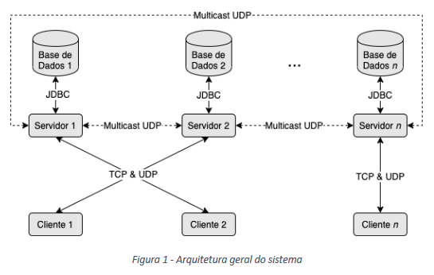

# Programação Distribuida (Meta 1)

## Introdução

Neste trabalho pretende-se que seja desenvolvido um sistema distribuído de comunicação em
rede, com características semelhantes ao *Slack*. A implementação será feita com a linguagem
Java, utilizando conceitos estudados na unidade curricular. O sistema será essencialmente
composto por dois tipos de aplicações: **cliente**, com a qual os utilizadores irão interagir,
e **servidor**, que será responsável por toda a lógica de negócio e pela persistência da informação.
Nas próximas seções são descritos os requisitos funcionais do sistema e os requisitos arquiteturais
para cada uma das aplicações.

## 1. Requisitos Funcionais

O sistema de comunicação em rede pretendido deve oferecer as seguintes funcionalidades:

- **Registo de novos utilizadores**, que são caracterizados por um nome, um *username*, uma
*password* e uma fotografia;
- **Autenticação de utilizadores** já registados através de um *username* e de uma *password*;
- **Criação, edição e eliminação de canais**, que são grupos onde diversos utilizadores podem
conversar entre si. Cada canal é caraterizado pelas seguintes informações: nome, descrição,
*password* de acesso e identificação do utilizador que o criou. Para aceder a um canal e
conversar com os restantes membros, um utilizador precisa de inserir a *password* de acesso.
Após ter sido criado, um canal só pode ser editado ou eliminado pelo utilizador que o criou;
- **Troca direta de mensagens entre utilizadores**, onde um utilizador apenas necessita de
saber o *username* do destinatário para conseguir enviar-lhe uma mensagem;
- **Partilha de ficheiros**, tanto de forma direta entre utilizadores como através de canais.
Neste último caso, após ter sido enviado para o sistema, o ficheiro fica disponível para
*download* por todos os membros do canal de destino. Podem ser partilhados ficheiros de
qualquer tipo. Após ser enviado, um ficheiro fica para sempre disponível para *download*
pelo(s) destinatário(s) (i.e., um utilizador específico ou um canal);
- **Listar todos os canais e utilizadores existentes** no sistema, sendo possível realizar
pesquisas e filtragens através dos atributos definidos para ambos. Todos os atributos devem
ser apresentados nas listagens obtidas;
- **Listar as *n* últimas mensagens trocadas** diretamente com um utilizador ou no contexto
de um canal;
- **Apresentar** os seguintes **dados estatísticos para cada canal**: número de utilizadores,
número de mensagens enviadas e número de ficheiros partilhados.

Ao implementar as funcionalidades descritas, tenha em consideração os seguintes aspetos:

- As funcionalidades só estão disponíveis para utilizadores autenticados, o que significa que
sem autenticação não se tem acesso ao sistema;
- Não podem ser criados utilizadores e canais com nomes iguais. Por outro lado, os nomes dos
ficheiros partilhados podem ser repetidos, sendo por isso necessário implementar estratégias
que permitam este aspeto;
- As operações de *upload* e *download* de ficheiros podem ser morosas e, em consequência,
bloquear a aplicação cliente durante um tempo exagerado na perspetiva do utilizador.
Desta forma, ambas as operações devem ser feitas em *background*, sendo o utilizador notificado
aquando do seu término;
- Existem aspetos relacionados com as funcionalidades descritas que estão omissos neste enunciado.
Isto significa que os alunos têm total liberdade para lidar com esses aspetos e implementarem
soluções de forma que melhor entenderem. Em caso de dúvidas, devem contactar um dos docentes para
as esclarecerem.

## 2. Requisitos Arquiteturais

A aquiterura geral do sistema aqui descrito é apresentada na Figura 1, sendo constituída pelos
seguintes elementos:

- Múltiplos (*n*) servidores, cada um com acesso a uma base de dados independente;
- Múltiplos (*n*) clientes, sendo que cada um comunica com um único servidor via UDP e TCP.

A implementação deve seguir os seguintes requisitos arquiteturais genéricos:

- Na fase de arranque os clientes recebem o endereço de IP de um dos servidores que está
ativo e cada servidor recebe o endereço de IP da máquina onde se encontra a sua respetiva
base de dados;
- Será valorizado o facto de o código das aplicações desenvolvidas ter sido estruturado de
uma forma modular, com uma separação clara entre a lógica de negócio, lógica de comunicação
e interface do utilizador, podendo esta ser em modo texto ou gráfico;
- As aplicações que constituem o sistema (clientes e servidores) necessitam de suportar a
execução simultânea de diversas operações (e.g., *downloads*, *uploads* e notificações
assíncronas). Desta forma, deve recorrer-se aos mecanismos de programação concorrente
estudados (e.g., *threads*) sempre que se justificar a sua utilização;
- Com exceção das interfaces do utilizador desenvolvidas (em modo texto ou gráfico),
a utilização de bibliotecas *third-party* (i.e., externas) na implementação do trabalho
é estritamente proibida, levando a que todos os componentes que as utilizem sejam ignorados
para efeitos da avaliação.

As duas aplicações a serem implementadas devem ter o seguinte funcionamento:

- Os clientes começam por contactar, via UDP, o servidor indicado na fase de arranque com
o objetivo de determinarem se podem estabelecer uma ligação TCP com este. Dependendo da carga
(i.e., do número de clientes conectados) que esse servidor tenha comparativamente aos restantes
que estão em execução, a resposta pode ser positiva ou negativa. Se existir pelo menos um
servidor ativo que tenha menos de 50% da carga atual do servidor inquirido, a resposta será
negativa. Caso contrátio, será positiva. Esta lista é ordenada em função das respetivas cargas
de forma crescente. O comportamento a adotar pelos clientes para as diferentes respostas é o
seguinte:
    - No caso de uma resposta negativa, o cliente deve repetir o processo de contacto para o
    primeiro servidor que lhe foi indicado na lista (i.e., com o menos carga);
    - No caso de uma resposta positiva, o cliente pode estabelecer uma ligação TCP com o
    servidor em causa.
- Para que a lógica descrita no ponto anterior seja exequível, cada servidor necessita de
saber quantos clientes estão ligados a si e aos restantes em execução. Assim sendo, sempre
que um novo cliente estabelece uma ligação TCP com um servidor, este deve enviar esta
informação por *multicast* UDP aos restantes servidores. Adicionalmente, todos os servidores
devem emitir um *ping* periódico, também por *multicast* UDP. Este *ping* permite que, caso
um servidor fique *offline*, os restantes tomem conhecimento e o excluam das suas listas de
servidores ativos;
- Depois de um dos servidores confirmar ao cliente que este se pode ligar via TCP, o cliente
deve estabelecer a respetiva ligação com o porto **9321**. Esta ligação é permanente e um
cliente está ligado a apenas um servidor;
- Casa servidor tem a sua base de dados independente, acedida via API JDBC, sendo recomendada
a utilização do sistema MySQL. No entanto, os alunos têm a liberdade de escolher outro sistema
desde que as bases de dados sejam relacionais;
- Toda a informação de um servidor é armazenada na sua respetiva base de dados, com exceção
dos ficheiros partilhados pelos utilizadores, que são armazenados diretamente no seu sistema
de ficheiros local (i.e., na base de dados apenas são armazenados os caminhos para os ficheiros);
- Um servidor, ao receber novos dados (mensagens, ficheiros, registos de utilizadores, etc.),
dissemina essa informação pelos restantes, via *multicast* UDP. O objetivo é que o estado dos
servidores seja coerente e que exista redundância suficiente para que, quando um termina, o
sistema continue totalmente operacional (desde que exista pelo menos um servidor ativo). A
estratégia a implementar para este fim fica ao critério dos alunos, devendo ser garantidos os
seguintes aspetos:
    - Um servidor, após enviar dados para os restantes servidores, deve obter a confirmação
    de que o envio ocorreu sem erros e sem perdas. Caso tal não aconteça, o envio deve ser
    repetido até um determinado limite de tentativas;
    - Os ficheiros devem ser divididos em *chunks* (i.e., partes) com um tamanho máximo de
    5kB, sendo cada *chunk* enviado individualmente para os restantes servidores.
- O cliente faz chegar as mensagens enviadas pelo utilizador ao servidor onde se encontra
ligado, utilizando a ligação TCP já estabelecida. Estas mensagens chegam depois aos clientes
destino através dos servidores a que estes estão ligados, utilizando igualmente as ligações
TCP já estabelecidas. Isto implica que os servidores possam enviar mensagens de forma
assíncrona aos seus clientes (i.e., sem ser em resposta a um pedido explícito dos clientes).
A disseminação das mensagens entre servidores é garantida pela abordagem discutida no ponto
anterior;
- A partilha de ficheiros por utilizadores segue a mesma abordagem descrita para as mensagens,
com a diferença de que um ficheiro não é imediatamente enviado para os clientes destino,
ficando armazenado nos servidores. Quando um ficheiro é partilhado, os clientes que lhe podem
aceder recebem uma mensagem onde consta o nome do ficheiro e um código que o identifica. Por
sua vez, quando um utilizador quiser fazer *download* de um ficheiro, deve fazer um pedido
nesse sentido ao seu servidor, indicando o código correspondente. Assim sendo, este processo
de *download* é síncrono;
- Em todos os cenários expostos, a comunicação pode ser feita de forma que os alunos entederem
ser mais apropriada. Ou seja, podem ser utilizadas estratégias baseadas em cadeias de caracteres
ASCII ou em objetos serializados;
- Quando um servidor termina de forma ordenada/intencional, este encerra as ligações TCP ativas,
o que faz com que os clientes que se encontram ligados a ele também terminem de forma ordenada;
- Deve existir um mecanismo de *failover* que atue da seguinte forma: caso um cliente esteja
ligado a um servidor que termina subitamente, este cliente deve ligar-se a um outro servidor de
forma automática, sem que o utilizador se aperceba do sucedido e sem que se perca a tarefa que
estava a ser executada durante o momento do término abrupto.
- Quando um servidor termina e volta a estar ativo mais tarde, é necessário garantir que este
fique consistente com os restantes servidores. Por outras palavras, é necessário que ele receba
os novos dados que possam eventualmente ter sido recebidos e armazenados pelos restantes enquanto
esteve *offline*. É de referir que este problema apenas pode ser resolvido quando o servidor em
causa não é o primeiro a ficar ativo. Caso seja o primeiro, o seu estado atual será assumido
como sendo o mais atualizado no sistema, servindo a informação que detém de referência para os
restantes.

## 3. Extras

A interface do utilizador da aplicação cliente descrita neste enunciado pode ser implementada
em modo consola (i.e., texto). Os aspetos fundamentais considerados na avaliação base são se
cumpre as funcionalidades pretendidas e se apresenta toda a informação necessária de forma
adequada aos utilizadores. No entanto, os alunos que apresentem uma aplicação que cumpra
minimamente os requisitos essenciais e que tenha uma interface do utilizador gráfica (GUI)
funcional e completa, terão uma bonificação extra que poderá ir até aos 7.5% da nota atribuída.
Ou seja, um trabalho avaliado em 80% que tenha a totalidade deste extra passa a valer 86%
(80% + 80% * 7.5%). Note-se que indexar esta bonificação à parte fundamental do trabalho
(i.e., funcionalidades) tem como objetivo evitar que se dê prioridade ao desenvolvimento da
GUI em detrimento do essencial. Caso a nota final com bonificação ultrapasse os 100%, esta
será truncada neste valor.

## 4. Considerações Gerais

Os alunos devem ter em consideração os seguintes aspetos para a realização do trabalho:

- As opções tomadas durante o projeto (e.g., aspetos não especificados no enunciado,
tratamento de erros, etc.), os aspetos relevantes do sistema desenvolvido (promenores
de implementação, diagrama de entidade relacionamento e modelo físico das bases de dados,
diagramas temporais, etc.) e o manual de utilizador devem ser devidamente documentados de
um modo sintético num documento do tipo PowerPoint;
- No documento referido na alínea anterior, é aconselhável a utilização de figuras e
capturas de ecrã;
- Esta 1ª fase do trabalho prático **deverá ser entregue até ao dia 11 de dezembro de 2020**,
através da plataforma InforEstudante, num ficheiro com a designação *PD-2021-F1-TP-Gx.zip*,
sendo *x* o número do grupo;
- O ficheiro referido no ponto anterior deve incluir o código fonte (ficheiros ".java") e
a documentação produzida, assim como os ficheiros auxiliares necessários à execução e teste
das aplicações sem necessidade de recorrer a qualquer IDE (e.g., o *byte code* gerado e
respetivas *batch files* e/ou ficheiros do tipo *jar* executáveis);
